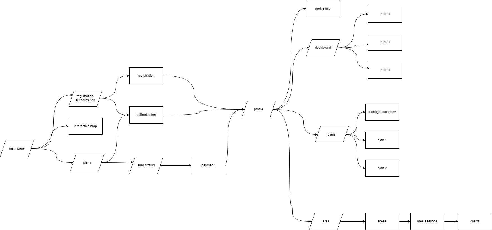
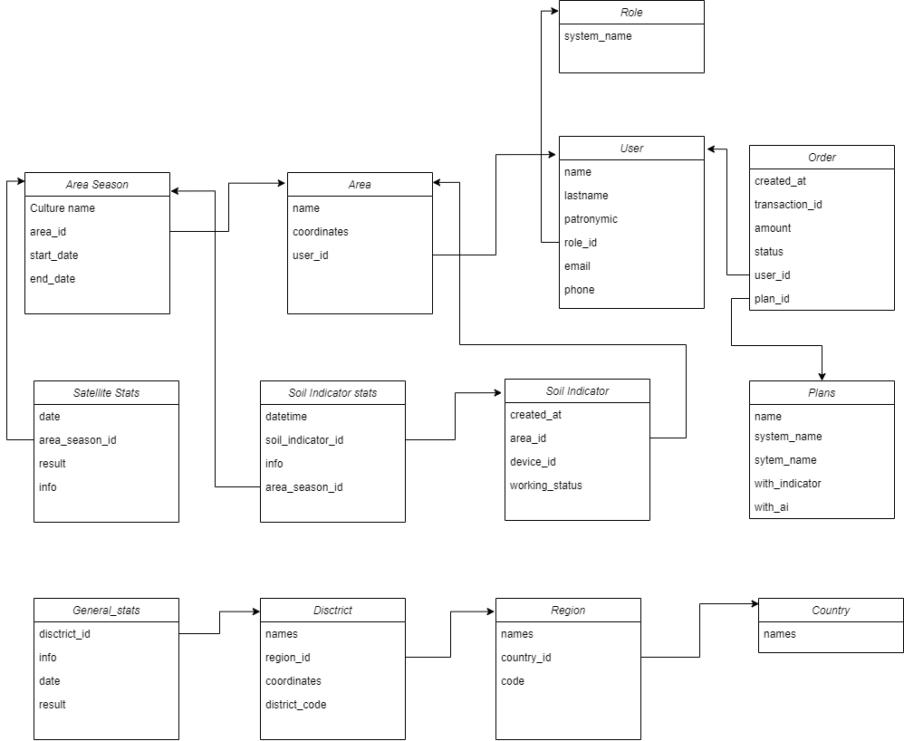

# FastAPI AI Project

## Описание
Этот проект реализован на FastAPI и использует Docker для контейнеризации AI компонента.

## Требования
- Docker
- Docker Compose
- Windows или другая ОС с поддержкой Docker

## Установка и запуск

### 1. Клонирование репозитория
Клонируйте репозиторий на свою локальную машину:
```bash
git clone https://github.com/yourusername/your-repo.git
```

### 2. Переход в папку с AI компонентом
```bash
cd your-repo/ai
```

### 3. Запуск Docker
Если вы используете Windows, убедитесь, что Docker запущен.

### 4. Сборка и запуск контейнеров
Выполните следующую команду для сборки и запуска контейнеров в фоновом режиме:
```bash
docker-compose up --build -d
```

## User Flow Diagram


## Database Structure


## Примечания
- Убедитесь, что у вас установлены последние версии Docker и Docker Compose.
- Все команды выполняются из директории `ai`.

## Лицензия
Этот проект лицензирован на условиях [MIT License](LICENSE).
